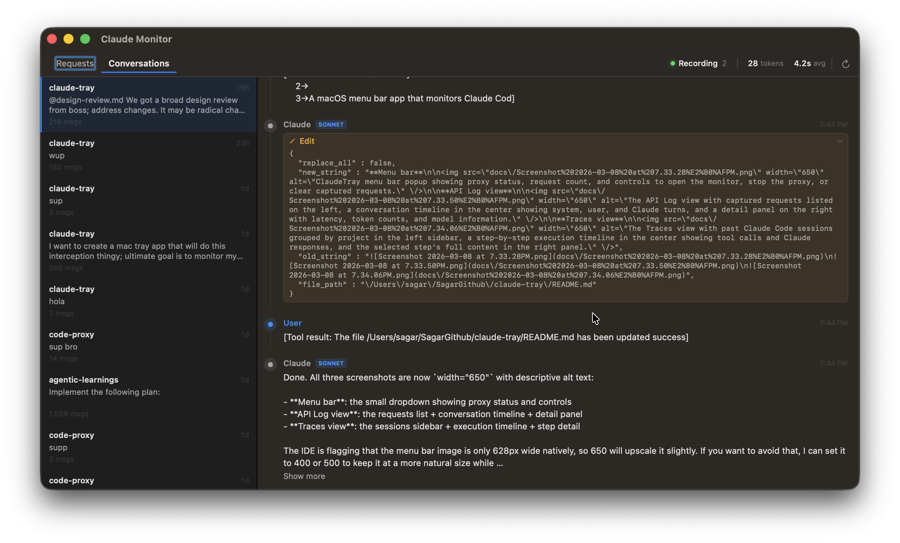
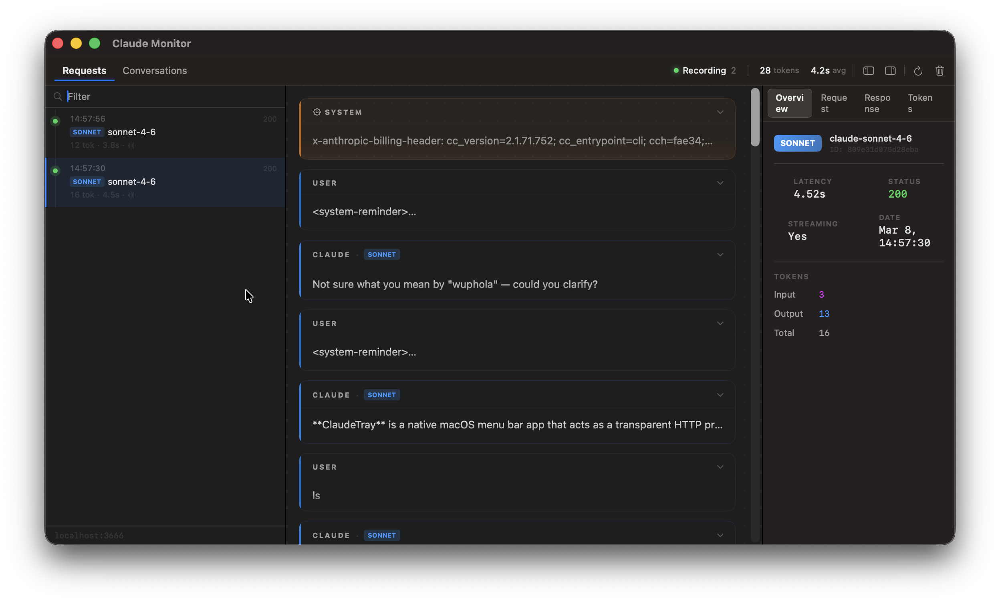
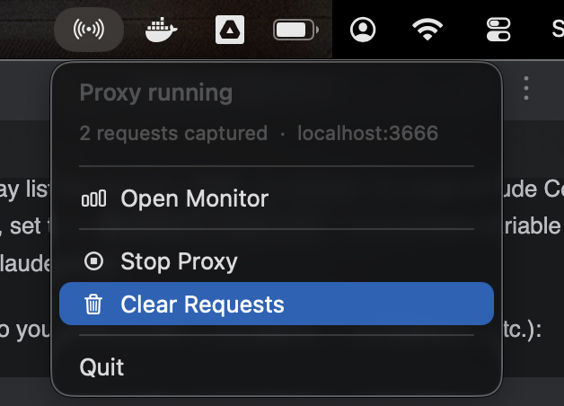

# ClaudeTray

A macOS menu bar app that monitors Claude Code in real time. It acts as a transparent HTTP proxy between Claude Code and the Anthropic API, capturing every request and letting you inspect the full execution trace:what the agent did, what tools it called, and what it decided.


## Screenshots

**Traces view**



**Menu bar**



**API Log view**



## What it does

ClaudeTray sits in your menu bar and intercepts Claude Code traffic. Every time Claude Code runs, you get a trace showing the complete execution: user prompts, model responses, tool calls, and the sequence of decisions the agent made to complete a task.

The monitor window has three panels. The left sidebar lists all traces grouped by activity. The center shows a step-by-step execution timeline for the selected trace. The right panel shows details for whichever step you click:full message text, model used, or tool arguments depending on the step type.

There is also an API Log view that shows raw HTTP requests and responses with token counts, latency, and response inspection.

Your API key is never stored. The proxy is fully transparent and does not modify requests or responses.


## Requirements

- macOS 14 or later
- Xcode 16 or later (for building from source)


## Build from source

```sh
git clone https://github.com/gaursagar21/claude-tray.git
cd claude-tray
make build
```

This produces `ClaudeTray.app` in the project directory. To install it to `/Applications`:

```sh
make install
```

If you have multiple Xcode versions installed, pass `DEVELOPER_DIR` explicitly:

```sh
DEVELOPER_DIR=/Applications/Xcode.app/Contents/Developer make build
```


## Setup

ClaudeTray listens on port `3666` by default. To route Claude Code traffic through it, set the `ANTHROPIC_BASE_URL` environment variable before starting Claude Code.

Add this to your shell profile (`~/.zshrc`, `~/.bashrc`, etc.):

```sh
export ANTHROPIC_BASE_URL=http://localhost:3666
```

Then reload your shell:

```sh
source ~/.zshrc
```

Start ClaudeTray from the menu bar or by running the binary. The menu bar icon will appear, and the proxy will start automatically. Open the monitor window from the menu bar icon.

Run Claude Code as normal. Traces will appear in the monitor as requests come in.


## Usage

**Traces view** is the default. Each row in the sidebar represents one Claude Code session:it shows the project name, the first message, when it was last active, how many steps it took, and how many tool calls were made. Sessions with errors are marked.

Click a trace to open its execution timeline. The timeline shows each step in order: user messages, Claude responses, and tool calls. Claude responses are displayed with more visual weight since they represent the agent's decisions. Click any step to see its full content in the right panel. Click a tool chip to see the arguments that were passed.

**API Log view** shows raw HTTP request and response pairs, with token counts, latency, model, and status code. Use this for debugging specific API calls. The request and response body are both available in a JSON viewer with syntax highlighting.

## References

I used the following excellent public works as a way to get started:
- [Reverse engineering Claude Code](https://kirshatrov.com/posts/claude-code-internals)
- [claude-reverse-proxy](https://github.com/seifghazi/claude-code-proxy)


## License

MIT
